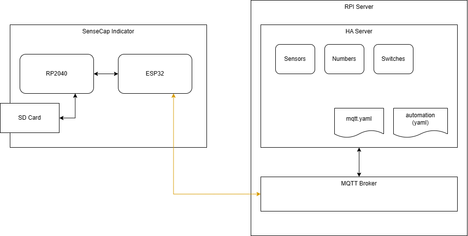

<p align="center">
  
</p>
<div align="center">

# Indicator Home Assistant with Configuration File

✨This project is based on the example project for SenseCap Indicator with added Home Assistant functions.✨

</div>

# Overview 

This version introduces dynamic screen loading based on a user-modifiable configuration file in JSON format, stored on an SDCard. This file includes Indicator screens (e.g., sensor displays, switches) and Home Assistant connection details, eliminating the need for firmware recompilation when adding new items.

<!-- The main difference is the feature to load Indicator screens (sensor, switch, etc.) based on a configuration file. The configuration file is stored in the SDCard and can be modified by the user. The configuration file is in JSON format. The configuration file is loaded at startup. -->

***Initial example look and feel used:***

<figure class="third">
    
    
    
    
</figure>

## System Atrchitecture



## Core Functions

- Real-time and historical data display for CO2, tVOC, temperature, and humidity.
- Wi-Fi, display, and time settings configuration.
- Home Assistant data integration and control functionality.

<!-- ⛔️ MD-MAGIC-EXAMPLE:START (TOC:collapse=true&collapseText=Click to expand) -->
<details>
<summary>Click to see details🖱️</summary>

- [x] Time display.
- [x] CO2, tVOC, Temperature and Humidity data real-time display.
- [x] CO2, tVOC, Temperature and Humidity history data display.
- [x] Wifi config.
- [x] Display config.
- [x] time config.
- [x] Home Assistant data.
- [x] Home Assistant control.

</details>
<!-- ⛔️ MD-MAGIC-EXAMPLE:END -->

## Enhanced Functionalities

<!-- In addition to the initial example, I added the possiblity to load screens with sensors and switches based on a configuration file. This JSON file contain as well the HA connection information (url, username, password). So there is no need to recompile the firmware to add new items.  -->

In addition to the core features, the project now supports:

- Loading different screen types (e.g., 1x1, 1x2, 2x3) and UI elements (e.g., sensor displays, switch buttons) from the configuration file.
- Easy modification of UI templates using squareline projects (located in the /squareline/ folder).

<!-- ⛔️ MD-MAGIC-EXAMPLE:START (TOC:collapse=true&collapseText=Click to expand) -->
<details>
<summary>Click to see the supported types🖱️</summary>

### Screens types

Different type of pages are support defined as grid:
- 1x1 (1 coluum of 1 Xlarge UI item)
- 1x2 (1 coloum of 2 large UI items)
- 1x3 (1 coloum of 3 medium UI items)
- 1x4 (1 coloum of 4 small UI items)
- 2x1 (2 coloums of 1 Xlarge UI item)
- 2x2 (2 coloums of 2 large UI items)
- 2x3 (2 coloums of 3 medium UI items)
- 2x4 (2 coloums of 4 small UI items)

### Type of UI items

1. Sensor : Display sensor data and select one of the 4 icons
2. Switch button : Display a switch button (Switch type in mqtt)
2. Switch toggle : Display a switch toggle (Switch type in mqtt)
3. Switch slider : Display a switch slider (Number type in mqtt)
4. Switch arc : Display a switch arc (Number type in mqtt)
5. Switch dropdown : Display a switch dropdown (Selec type in mqtt)

</details>
<!-- ⛔️ MD-MAGIC-EXAMPLE:END -->

## UI Template Customization

### How to modify the UI templates

The UI templates are based on squareline (see /squareline/ sub folder with projects) with different UI elements. 
You can find few projects for large, medium and small screens. You can modify the UI elements, generate the code and modify the `./main/ui/screens/ui_sreen_ha_templates` files.

### How to use this version

Please first read the [User Guide](https://wiki.seeedstudio.com/Sensor/SenseCAP/SenseCAP_Indicator/Get_started_with_SenseCAP_Indicator/) of the SenseCAP Indicator Board to learn about its software and hardware information.

#### Configuration file JSON

The heart of this project's customization lies in the configuration file, which is stored on an SDCard and loaded by the RP2040(the ESP32 MCU will request the configuration file from the RP2040 and generate screens, sensors and swtiches.):

Structure of the config file : 

```json
{
    "url": "mqtt://<url>",
    "username": "<username>",
    "password": "<password>",
    "pages": [
        {
            "name": "<PAGE_NAME>",
            "label": "<PAGE_LABEL>",
            "type": "<PAGE_TYPE>",
            "sensors": [
                {
                    "name": "<SENSOR_NAME>",
                    "label": "<SENSOR_LABEL>",
                    "unit": "<SENSOR_UNIT>",
                    "key": "<SENSOR_HA_KEY>",
                    "x": "<SENSOR_X>",
                    "y": "<SENSOR_Y>",
                    "icon": "<SENSOR_ICON>",
                    "size": "<SENSOR_SIZE>"
                },
            ],
            "switches": [
                {
                    "name": "<SWITCH_NAME>",
                    "label": "<SWITCH_LABEL>",
                    "key": "<SWITCH_HA_KEY>",
                    "x": "<SWITCH_X>",
                    "y": "<SWITCH_Y>",
                    "type": "<SWITCH_TYPE>",
                    "size": "<SWITCH_SIZE>",                 
                    "unit": "<SWITCH_UNIT>"   
                },
            ]
        }
    ]
}
```

You can see the example of the configuration file: [ha_config.json.template](./config/ha_config.json.template) file.

## Home Assistant Configuration (mqtt.yaml)

You need to configure Home assistant to receive and send data from/to the Indicator device. The following is an example of the mqtt.yaml file.

```yaml
sensor:
  # SenseCAP Sensors
  - unique_id: SC_temperature
    name: "SC Temperature"
    state_topic: "indicator/sensor"
    #suggested_display_precision: 1
    unit_of_measurement: "°C"
    value_template: "{{ value_json.temp }}"
  - unique_id: SC_humidity
    name: "SC Humidity"
    state_topic: "indicator/sensor"
    unit_of_measurement: "%"
    value_template: "{{ value_json.humidity }}"
  - unique_id: SC_co2
    name: "SC CO2"
    state_topic: "indicator/sensor"
    unit_of_measurement: "ppm"
    value_template: "{{ value_json.co2 }}"
  - unique_id: SC_tvoc
    name: "SC tVOC"
    state_topic: "indicator/sensor"
    unit_of_measurement: ""
    value_template: "{{ value_json.tvoc }}"
  # Additonal Sensors
  - unique_id: <SENSOR_ID>
    name: "<SENSOR_NAME>"
    state_topic: "indicator/sensor"
    unit_of_measurement: "<SENSOR_UNIT>"
    value_template: "{{ value_json.<SENSOR_HA_KEY> }}"
switch:
  - unique_id: <SWITCH_ID>
    name: "<SWITCH_NAME>"
    state_topic: "indicator/switch/state"
    command_topic: "indicator/switch/set"
    value_template: "{{ value_json.<SWITCH_HA_KEY> }}"
    payload_on: '{"<SWITCH_HA_KEY>":1}'
    payload_off: '{"<SWITCH_HA_KEY>":0}'
    state_on: 1
    state_off: 0
number:
  - unique_id: <SWITCH_ID>
    name: "<SWITCH_NAME>"
    state_topic: "indicator/switch/state"
    command_topic: "indicator/switch/set"
    command_template: '{"<SWITCH_HA_KEY>": {{ value }} }'
    value_template: "{{ value_json.<SWITCH_HA_KEY> }}"
```

### Home Assistant Automation for senors data publishing

If you want to display any information from HA on SenseCap Indicator screens (like temp, humidity of other sensors, rooms), you need to create an automation to publish the data to the Indicator device.

*Example of the automation*
Publish a temperature and humidity sensor data on MQTT every minute (time_pattern)

```yaml
alias: MQTT - <Automation Name>
description: ""
trigger:
  - platform: time_pattern
    minutes: "*"
    hours: "*"
condition: []
action:
  - service: mqtt.publish
    data:
      qos: "0"
      retain: false
      topic: indicator/sensor
      payload: >-
        {"<SENSOR_HA_KEY>" : "{{states('sensor.<HA_SENSOR_NAME>')
        }}"}
  - service: mqtt.publish
    data:
      qos: "0"
      retain: false
      topic: indicator/sensor
      payload: "{\"<SENSOR_HA_KEY>\" : \"{{states('sensor.<HA_SENSOR_NAME>') }}\"}"
mode: single
```
## Building and Flashing Instructions

### Build and Flash (RP2040)

To build and flash the RP2040 for this project, follow these steps using the Arduino IDE:

1. **Install Arduino IDE**
2. **Add Raspberry Pi Pico Board**
3. **Install Required Libraries**: Add the following libraries to your Arduino IDE to ensure compatibility with the project's sensors and functionalities:
   - **Sensirion Core**: For core functionality of Sensirion sensors.
   - **PacketSerial**: Enables serial communication.
   - **Sensirion I2C SGP40**: Library for the SGP40 TVOC sensor.
   - **Sensirion I2C SCD4x**: For the SCD41 CO2 sensor.
   - **Sensirion Gas Index Algorithm**: Used for gas index calculations.
   - **Seeed_Arduino_AHT20**: For the AHT20 temperature and humidity sensor.
4. **Select Board and Port**: In the Arduino IDE, search for and select the "Seeed INDICATOR RP2040" board. Then, choose the appropriate serial port (usually labeled as usbmodem).
5. **Build and Flash**

For more detailed instructions, including setting up the Arduino IDE and troubleshooting common issues, refer to the [Seeed Studio guide](https://wiki.seeedstudio.com/SenseCAP_Indicator_How_To_Flash_The_Default_Firmware/#for-rp2040) or [repo:SenseCAP Indicator RP2040](https://github.com/Seeed-Solution/SenseCAP_Indicator_RP2040).

### Build and Flash (ESP32)

To set up your ESP32 for this project, follow these steps:

1. **Install ESP-IDF**: Begin by installing the ESP-IDF (Espressif IoT Development Framework) from the official [ESP-IDF Getting Started Guide](https://docs.espressif.com/projects/esp-idf/en/latest/esp32/get-started/index.html). This framework provides the necessary tools and libraries for ESP32 development.

2. **Build, Flash, and Monitor**: Use the command `idf.py -p PORT flash monitor` in your terminal to build the project, flash it to the ESP32, and open the serial monitor. This command allows you to observe real-time logs from the ESP32. To exit the serial monitor, press `Ctrl-]`.

For a comprehensive walkthrough, refer to the detailed [Getting Started Guide with ESP-IDF](https://docs.espressif.com/projects/esp-idf/en/latest/get-started/index.html). This guide covers everything from setting up the development environment to running your first project.

For additional information and specific instructions for the SenseCAP Indicator project, consult the [Seeed Studio guide](https://wiki.seeedstudio.com/SenseCAP_Indicator_How_To_Flash_The_Default_Firmware/#for-esp32-s3) or [repo:SenseCAP Indicator ESP32](https://github.com/Seeed-Solution/SenseCAP_Indicator_ESP32).